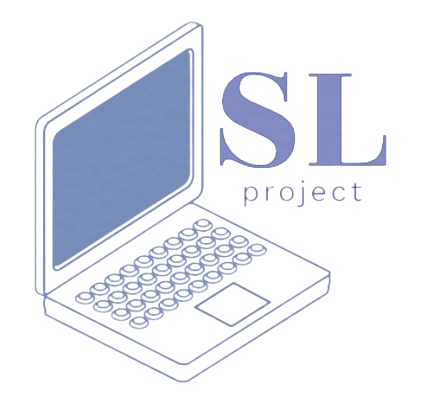

# SL-project


</p>

## 🖥 Team Members:
* **Lorena Hristova** - *Scrum trainer* 
* **Svetoslav Stoilov** - *Back-end developer* 
* **Lorena Hristova** - *Back-end developer* 
* **Svetoslav Stoilov** - *QA documentation* 

   
## ⚙ Installation
```
You can download the application from [github](https://github.com/LRGeorgiev/ELLS-Physics-project.git) 
by pressing the green ,,Code" button and than press "Download ZIP".
 ```
 
## Future updates

-adding more options

## Thank you for using our app
If you support and like our project, you can always share it with people on social media.
